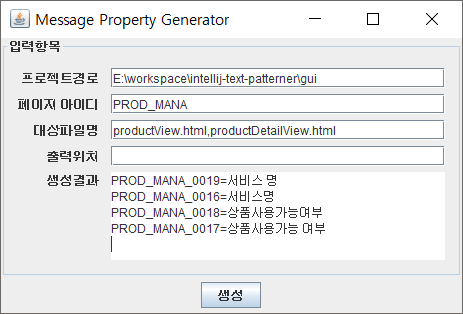

# Message Property Helper Library
message.properties 작업을 위한 유틸리티 라이브러리

### 1.module

#### 1.0 common
<pre><code>//base common model having String value 
//which is used when migrate data to other module.
public class Expression {
    private String value;
}
</code></pre>
<pre><code>//used to express Message Property
//having Key and Value
public class MessageProperty {
    private Key key;
    private Value value;
}
</code></pre>

#### 1.1 collect
특정 Input 데이터에 대하여 원하는 문자열을 수집한다.
<pre><code>//using interface (T:input type, U:output type)
public interface PatternSearcher<T, U> {
   List<U> get(T source);
}
</code></pre>
<pre><code>//define regular expression or something you want to get from pattern
PatternSearcher<Expression, Expression> thymeleafTextValuePatternSearcher = new ThymeleafTextPatternSearcher();
PatternSearcher<Expression, Expression> valuePatternSearcher = new ValuePatternSearcher();
</code></pre>
<pre><code>//collect from list of Expression
List<Expression> thymeleafTextExpressions = collector.collect(expressions, thymeleafTextValuePatternSearcher);
List<Expression> valuePatternExpressions = collector.collect(thymeleafTextExpressions, valuePatternSearcher);
</code></pre>

#### 1.2 search
message.properties파일에서 입력으로 받은 문자열을 검색한다.
<pre><code>KMP알고리즘을 이용하여 비교를 진행하며, 각 Message는 다음과 같은 결과로 구분되어짐
ResultClass.TotalEqual
ResultClass.TotalSimilar
ResultClass.PartialEquals
ResultClass.PartialSimlar
</code></pre>

Result Example
<pre><code><테스트코드>
@Test
public void findFromResourceFile() throws IOException {
    String[] inputDatas = new String[]{
            "제휴 계약 관리"
    };
    String location = ".\\resources\\";
    String bundleName = "messages";
    MessageSearchManager messageSearchManager = new MessageSearchManager();
    messageSearchManager.findFromResourceFile(inputDatas, location, bundleName);
}
</code></pre>
<pre><code><실행결과>
----찾고 싶은 메세지----
INPUTKEY_0001 : 제휴 계약 관리 
----결과----
	[TotalEqual]
	PROD_MANA_0001 : 제휴 계약 관리 

	[PartialEquals]
	PROD_MANA_0005 : 제휴 계약 
	PROD_MANA_0006 : 계약 

	[TotalSimilar]
	PROD_MANA_0012 : 제휴계 약 관리 
	PROD_MANA_0011 : 제휴계약관리 
</code></pre>

#### 1.3 generate
특정 Input데이터에 대하여 Key를 생성한다. 입력으로 받은 KeyNameRule 구현부를 이용하여 특정 규칙을 가지는 key를 생성한다.
<pre><code>//using interface KeyNameRule
public interface KeyNameRule {
    String getKey(Expression expression);
}
</code></pre>
<pre><code>//define key name rule
KeyNameRule keyNameRule = new PortalKeyNameRule("PROD_MANA", "_", messageProertyMap);
</code></pre>
<pre><code>//generate key name by KeyNameRule implementation
List<MessageProperty> messageProperties = generator.generate(failureExpressions, keyNameRule);
</code></pre>

#### 1.4 replace
완성된 key set을 이용하여 html내부에서 해당 문자열을 message.properties의 key로 교체한다.
